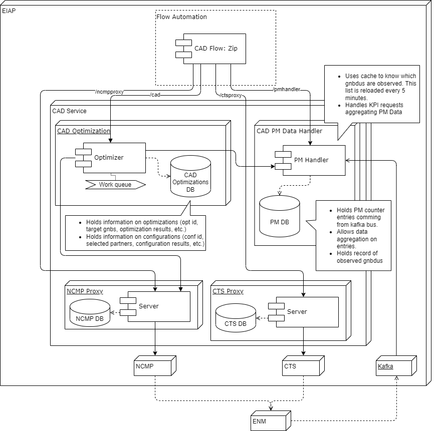

ERICSSON © 2022

# Carrier Aggregation Deployment Radio Application - CAD rApp

This repository holds the rApp code and automation scripts for the CAD rApp. This file provides a quick look at the
structure of this project and how to perform a quick setup of the project on your machine.

---

# Table of Contents

* [About The Project](#about-the-project)
    * [Introduction](#introduction)
    * [Project Structure](#project-structure)
* [Getting Started](#getting-started)
    * [Requirements](#requirements)
    * [General Actions](#general-actions)
    * [Docker Compose Actions](#docker-compose-actions)
    * [CAD Optimization Commands](#cad-optimization-commands)
    * [CAD Flow Commands](#cad-flow-commands)
* [Support](#support)
    * [Project Contributors](#project-contributors)
* [License](#license)
* [Important Notes](#important-notes)

---

# About The Project

## Introduction

Selecting and configuring the optimal Advanced RAN Coordination (ARC) partners over E5 link is challenging and
time-consuming. There is a need to optimize and automate this task. A central application containing optimization
algorithm
is proposed as a solution. The app will be deployed on Ericsson Intelligent Automation Platform (Ericsson’s SMO) and
will interact with available microservices. Commercial name of the developed functionality is “Carrier Aggregation
Deployment rApp”.

Carrier Aggregation is a highly appreciated functionality as it enables capability of aggregating several frequency
bands for higher peek rates and increased cell coverage. Advanced RAN Coordination is an Ericsson innovation that
provides low-latency coordination interface between two 5G RAN compute products. It enables CA even when carriers are
split across different RAN compute products. Carrier Aggregation Deployment rApp (CAD rApp) automates the tedious and
difficult process of configuring the optimal gNB coordination partners. As networks are growing, this could be even more
problematic, and the benefit of using CAD rApp will be even bigger.

## Project Structure

CAD rApp is composed of 5 components presented next:


1. **[CAD Flow](./flows/README.md)** (`/flowAutomation`)
   Developed on Flow Automation (a service provided by EIAP). It interacts with users to retrieve operator’s input and
   configuration used to perform the network optimization.
   Technologies used in this module: Groovy, BPMN, JSON, Java
2. **[CAD Optimization](./OSS_CAD_Service/README.md)** (`/ArcSwU`)
   This service handles instances for both optimization and node configuration. It holds the information about the
   status of each instance and its results.
   Technologies used in this module: Python, FastAPI, Uvicorn, NumPy, Pandas, MongoDB
3. **[CAD PM Data Handler](./OSS_PM_Data_Handler/README.md)** (`/PM_Data_Handler`)
   This service is responsible for collecting the metrics of nodes currently under optimization and provide statistics
   from this collected data.
   Technologies used in this module: Python, FastAPI, Uvicorn, MongoDB

In addition to the rApp components, there are additional resources containing complementary information and automations
for CI (Continuous Integration) and CD (Continuous Deployment):

- **EIAP integration**
  Presented in [`/charts`](../charts/README.md) and [`/csar`](./csar/README.md), it contains the scripts to create the
  helm chart and the CSAR package needed to deploy the rApp on EIAP.
- **[Continuous Integration and Continuous Deployment](eric-oss-bb-link-coordinator/ci/README.md)**
  Presented in `/ci`, it contains the scripts needed to automate the testing, verification and packaging procedures
  launched every time a patch set is sent to the Gerrit repository.

---

# Getting Started

## Requirements

Since this project has several interacting services, a local setup automation tool has been created using Makefile and
scripts located in `/env`. A set of actions are included to create the execution environment and compile, test and
deploy (locally), all the docker containers needed to run the rApp. To run these commands you need the following
prerequisites:

- Use a linux environment or setup WSL
- Docker installed in the linux environment. In ericsson it might be necessary to do a login for the docker image
  registry:
  ```docker
  docker login armdocker.rnd.ericsson.se
  ```
- Python 3.10+ installed
- Makefile installed

## General Actions

To get a description of available actions please use the following in a terminal:

```makefile
make
```

or

```makefile
make help
```

A list with available commands and their description will be presented.  
To check the application requirements use

```makefile
make check_requirements
```

You can try and launch (create and start) the entire application locally with

```makefile
make launch_local
```

If you want to include tests use:

```makefile
make launch_local_test
```

To remove it (shutdown containers and remove images), use

```makefile
make remove_local
```

## Docker Compose Actions

* Build docker images and start all containers:

```makefile
make compose_launch
```

* Start all docker containers:

```makefile
make compose_up
```

* Stop all docker containers (removes containers, volumes and networks):

```makefile
make compose_stop
```

* Rebuild (stop, build and start) all docker images:

```makefile
make compose_rebuild
```

* Rebuild cts mock service:

```makefile
make compose_rebuild_cts
```

* Rebuild ncmp mock service:

```makefile
make compose_rebuild_ncmp
```

## CAD Optimization commands

Start ARC application container

```makefile
make arc_container_up
```

Stop ARC application container

```makefile
make arc_container_down
```

Reload (stop, builds and start) ARC application

```makefile
make arc_reload
```

Run ARC application unit tests

```makefile
make arc_test
```

## CAD flow commands

Build and upload to local docker environment:

```makefile
make flow_launch_local
```

Build and run ARC flow unit tests:

```makefile
make flow_install
```

Run ARC flow integration tests (must be packaged before):

```makefile
make flow_install_integration_test
```

Upload ARC flow archive to local docker environment:

```makefile
make flow_upload_local
```

Remove ARC flow installed in local docker environment:

```makefile
make flow_delete_local
```

Reload (unload, build, unit test and upload) ARC flow to local E2E environment

```makefile
make flow_relaunch_local
```

---

# Support

The following persons have contributed to the code in this repository. Please contact them for further information.

## Project contributors

[Ikbel Benabdessamad](mailto:ikbel.benabdessamad@ericsson.com)  
[Peiliang Chang](mailto:peiliang.chang@ericsson.com)  
[Papa Demba](mailto:papa.demba.diallo@ericsson.com)  
[Wassim Derbel](mailto:wassim.derbel@ericsson.com)  
[Daniel Gonzalez](mailto:daniel.felipe.gonzalez.obando@ericsson.com)  
[Qasim Khalid](mailto:qasim.khalid@ericsson.com)  
[Nizar Louhichi](mailto:nizar.louhichi@ericsson.com)  
[Laurent Mariko](mailto:laurent.mariko@ericsson.com)  
[Stephen Sarpong Antwi](mailto:stephen.sarpong.antwi@ericsson.com)  
[Wojciech Rakow](mailto:wojciech.xx.rakow@ericsson.com)  
[Mats Zachrison](mailto:mats.zachrison@ericsson.com)  
[Zohra Zribi](mailto:zohra.zribi@ericsson.com)  
[](mailto:ikbel.benabdessamad@ericsson.com,peiliang.chang@ericsson.com,papa.demba.diallo@ericsson.com,wassim.derbel@ericsson.com,daniel.felipe.gonzalez.obando@ericsson.com,qasim.khalid@ericsson.com,nizar.louhichi@ericsson.com,laurent.mariko@ericsson.com,stephen.sarpong.antwi@ericsson.com,wojciech.xx.rakow@ericsson.com,mats.zachrison@ericsson.com,zohra.zribi@ericsson.com)

---

# License

This project is not yet licensed - see the [LICENSE.md](LICENSE.md) file for details

---

# Important Notes

> 📝 Internal navigation doesn't work in Markdown preview for PyCharm IDE with versions lower than
> 2022.2.3 [Link](https://youtrack.jetbrains.com/issue/IDEA-213085/Internal-navigation-doesnt-work-in-Markdown-preview)